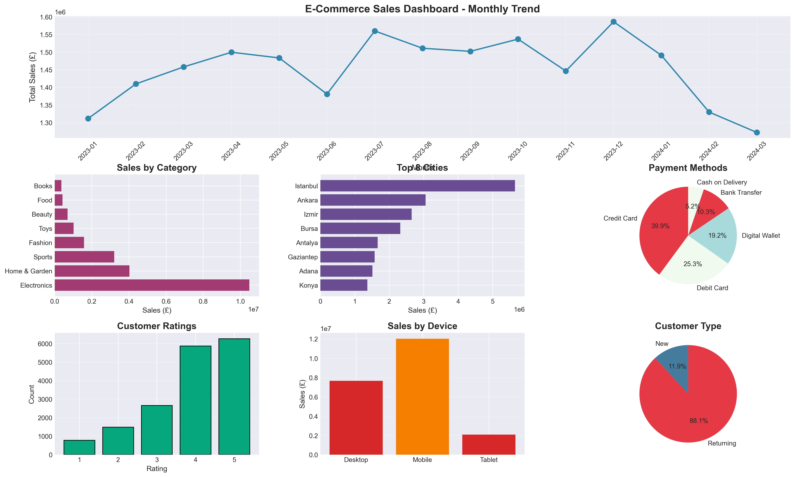
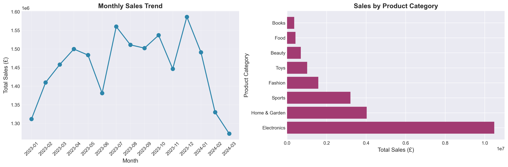
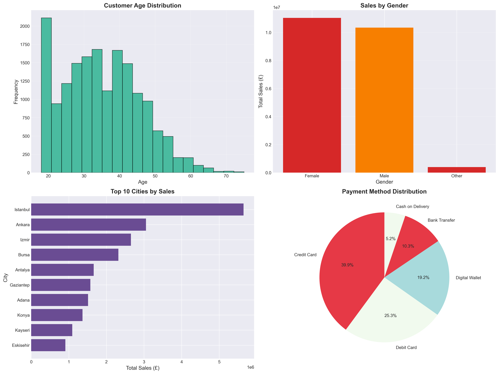

# E-Commerce Sales Analytics Dashboard


---

## 📊 Dashboard Preview



---

## 🎯 Project Overview

A comprehensive e-commerce sales analytics dashboard analyzing **17,049 transactions** and **£21.7M in revenue**. This project demonstrates data analysis, visualization, and business intelligence capabilities to uncover customer behavior patterns and drive data-driven decisions.

**Key Achievement:** Created actionable insights showing mobile devices drive 55% of sales and 88% customer retention rate.

---

## 💡 Key Business Insights

### 📈 Performance Metrics:
- **Total Revenue:** £21.78M
- **Total Orders:** 17,049  
- **Average Order Value:** £1,277
- **Customer Retention:** 88.2%
- **Average Rating:** 3.90/5.0

### 🏆 Top Findings:
1. **Electronics dominates** - 48% of total revenue (£10.48M)
2. **Mobile-first customers** - 55% of sales from mobile devices
3. **Istanbul leads** - 26% of total revenue from one city
4. **High retention** - 88% returning customers (excellent!)
5. **Improvement opportunity** - Customer rating at 3.9/5.0

---

## 📊 Visualizations

The dashboard includes:
- **Monthly Sales Trend** - Revenue patterns over time
- **Product Category Performance** - Top revenue generators
- **Customer Demographics** - Age and gender distribution
- **Geographic Analysis** - Top 10 cities by revenue
- **Device Usage** - Mobile vs Desktop vs Tablet
- **Payment Methods** - Customer payment preferences
- **Customer Ratings** - Satisfaction distribution




---

## 🛠️ Technologies Used

- **Python 3.8+** - Data analysis and visualization
- **Pandas & NumPy** - Data manipulation
- **Matplotlib & Seaborn** - Creating visualizations
- **Jupyter Notebook** - Interactive analysis

---

## 🚀 How to Run

### Prerequisites:
```bash
pip install pandas numpy matplotlib seaborn jupyter
```

### Steps:
1. Clone this repository
2. Navigate to project folder
3. Start Jupyter: `jupyter notebook`
4. Open `ecommerce_analysis.ipynb`
5. Run all cells

---

## 💼 Business Recommendations

Based on analysis:

1. **Optimize for Mobile** - 55% of sales come from mobile; invest in mobile app
2. **Focus on Electronics** - Top category with 48% revenue share
3. **Leverage Istanbul Market** - Strongest market; expand presence
4. **Improve Customer Satisfaction** - Current 3.9/5.0; target 4.5+
5. **Retention Programs** - 88% retention is strong; maintain with loyalty rewards

---

## 📈 Skills Demonstrated

✅ Data cleaning and preprocessing  
✅ Exploratory data analysis (EDA)  
✅ Statistical analysis and aggregation  
✅ Data visualization and dashboard design  
✅ Business metrics interpretation  
✅ Actionable recommendations  

---

## 📁 Project Structure

```
ecommerce-dashboard/
├── data/
│   └── ecommerce_data.csv
├── notebooks/
│   └── ecommerce_analysis.ipynb
├── images/
│   ├── complete_dashboard.png
│   ├── sales_overview.png
│   └── customer_insights.png
└── README.md
```

---

## 👤 Author

**Vindya Siriwardhana**
- MSc Data Science - University of Essex
- MSc Applied Statistics - University of Colombo
- 📧 asvindyaravi@gmail.com
- 💼 [LinkedIn](https://www.linkedin.com/in/vindya-siriwardhana/)
- 🔗 [GitHub](https://github.com/Vindya-Siriwardhana)

---

## 📝 Future Enhancements

- Sales forecasting with machine learning
- Customer segmentation clustering
- Recommendation engine
- Interactive Plotly dashboard
- Real-time monitoring system

---

⭐ **If you found this project useful, please star the repository!**
